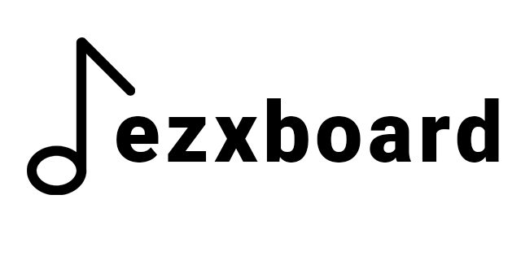

<p align="center">
  
  
  
  <a href="https://github.com/ezxmora/ezxboard/commits/main"></a>
</p>
"Customizable" and expandable Electron and React soundboard

## Installation

-   Go to [releases](https://github.com/ezxmora/ezxboard/releases)
-   Select the portable or the instalable version
-   Download it
-   ???
-   Done

## Building

If you feel like building the project because you don't like something on it ~~(I can't blame you)~~ you have two options, run it with:

```Bash
yarn install
# Edit whatever you have to edit
yarn run dist
```

or

```Bash
rm yarn.lock
npm install
# Edit whatever you have to edit
npm run dist
```

## Contribute

If you feel like something is missing or have some ideas you can create a [pull request](https://github.com/ezxmora/ezxboard/pulls)

### Acknowledgments

-   [Awakened PoE Trade](https://github.com/SnosMe/awakened-poe-trade)
-   [secure-electron-template](https://github.com/reZach/secure-electron-template)
